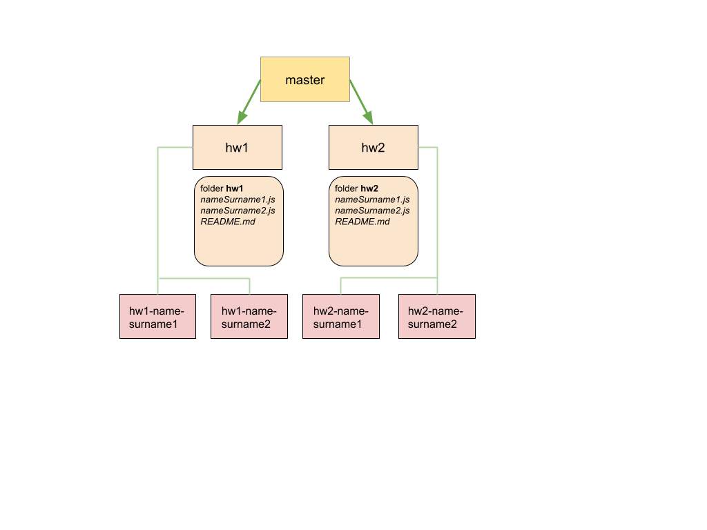

# SEP-homeworks

Repository for student's homework

## Git Flow
The main branch is `master`.
Each hometask have it's separate branch (e.g. `hw1`) with a folder with the same name and `.js` or `.md` file with task description. For executing the task student should create a branch from hometask branch in format `[initial branch name]-[student name or github nick]` (e.g `hw1-vickierose`). Task should be performed in a `.js` file named with student's name or github nick (e.g. `vickierose.js`) inside hometask folder.
After finishing task student should create a pull request to the initial branch and mark mentor as a reviewer. PR should be merged :exclamation: **ONLY** :exclamation: after mentor's approve.
After all students finished their homework and all the PRs are merged to the hometask branch that branch is merged to `master`.
Visual representation of git flow may be seen below

